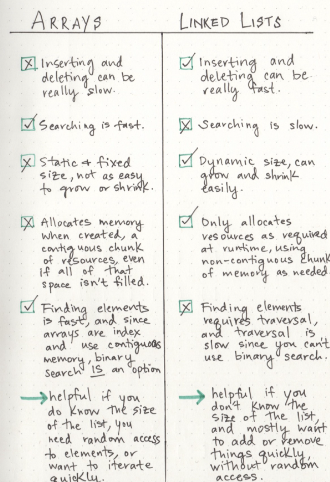

## Linked Lists

**What is a Linked List**

There are two types of Linked List - Singly and Doubly. 

* Terminology:

* Linked List - A data structure that contains nodes that links/points to the next node in the list.

* Singly - Singly refers to the number of references the node has. A Singly linked list means that there is only one reference, and the reference points to the Next node in a linked list.

* Doubly - Doubly refers to there being two (double) references within the node. A Doubly linked list means that there is a reference to both the Next and Previous node.

* Node - Nodes are the individual items/links that live in a linked list. Each node contains the data for each link.
 
* Next - Each node contains a property called Next. This property contains the reference to the next node.

* Head - The Head is a reference of type Node to the first node in a linked list.

* Current - The Current is a reference of type Node to the node that is currently being looked at. When traversing, you create a new Current variable at the Head to guarantee you are starting from the beginning of the linked list.

## What’s a Linked List, Anyway?

**Linear data structures**

They are linear data structures, which means that there is a sequence and an order to how they are constructed and traversed. In non-linear data structures, items don’t have to be arranged in order, which means that we could traverse the data structure non-sequentially.

**Memory management**

The biggest differentiator between arrays and linked lists is the way that they use memory in our machines. The fundamental difference between arrays and linked lists is that arrays are static data structures, while linked lists are dynamic data structures.

**What even is Big O?**

Big O Notation is a way of evaluating the performance of an algorithm. One way to think about Big O notation is a way to express the amount of time that a function, action, or algorithm takes to run based on how many elements we pass to that function.

**To list or not to list?**

