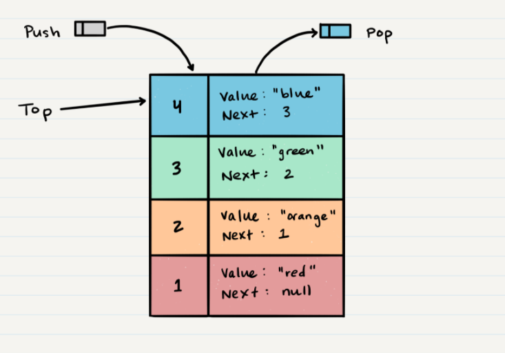

# Stacks & Queues

***What is a Stack***

A stack is a data structure that consists of Nodes. Each Node references only the next Node in the stack, and follow these concepts: FILO, and LIFO.

* Common terminology for a stack:

1- Push

2- Pop

3- Top

4- Peek

5- IsEmpty

***Stack Visualization***

The topmost item is denoted as the top. When you push something to the stack, it becomes the new top. When you pop something from the stack, you pop the current top and set the next top as top.next.

* Push O(1)

Pushing a Node onto a stack will always be an O(1) operation. 

The pseudocode to push a value onto a stack:

<
  // INPUT <-- value to add, wrapped in Node internally

  // OUTPUT <-- none

   node = new Node(value)

   node.next <-- Top

   top <-- Node
>

* Pop O(1)

The pseudocode to pop a value onto a stack:

<
// INPUT <-- No input

// OUTPUT <-- value of top Node in stack

// EXCEPTION if stack is empty

   Node temp <-- top

   top <-- top.next
   
   temp.next <-- null
   
   return temp.value
>

* Peek O(1)

The pseudocode to peek a value onto a stack:

<
// INPUT <-- none

// OUTPUT <-- value of top Node in stack

// EXCEPTION if stack is empty

   return top.value
>

* IsEmpty O(1)

The pseudocode to peek a value onto a stack:

<
// INPUT <-- none

// OUTPUT <-- boolean

return top = NULL
>

***What is a Queue***

Common terminology for a queue is:

1- Enqueue O(1)

<
  // INPUT <-- value to add to queue (will be wrapped in Node internally)

  // OUTPUT <-- none
 
   node = new Node(value)
 
   rear.next <-- node
 
   rear <-- node
>

2- Dequeue O(1)

<
// INPUT <-- none
// OUTPUT <-- value of the removed Node

// EXCEPTION if queue is empty

   Node temp <-- front

   front <-- front.next

   temp.next <-- null

   return temp.value
>

3- Front

4- Rear

5- Peek 

<
// INPUT <-- none

// OUTPUT <-- value of the front Node in Queue

// EXCEPTION if Queue is empty

   return front.value
>

6- IsEmpty

<
// INPUT <-- none

// OUTPUT <-- boolean

return front = NULL
>

Queues follow FIFO, and LILO.

* Queue Visualization

