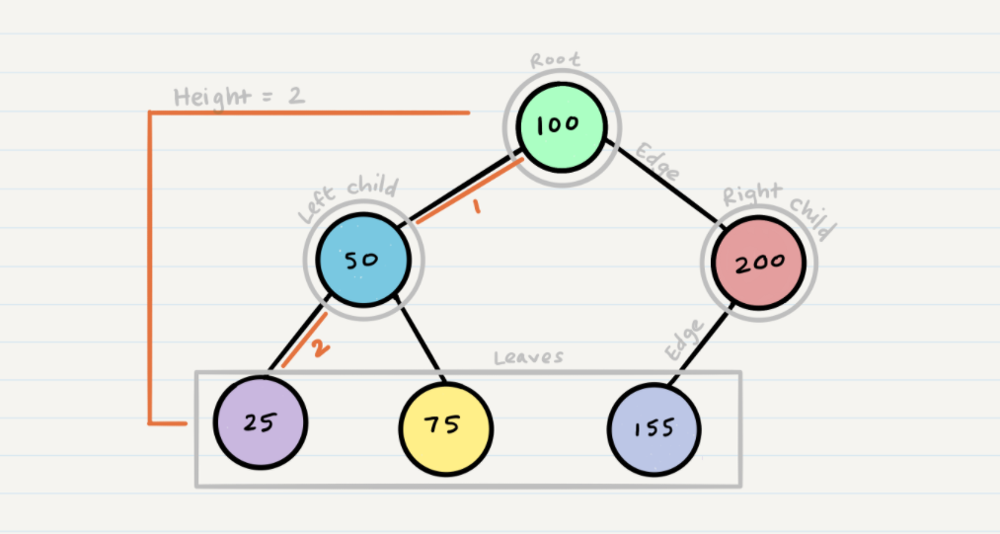

# Trees

## Common Terminology

* Node - A Tree node is a component which may contain it’s own values, and references to other nodes

* Root - The root is the node at the beginning of the tree

* K - A number that specifies the maximum number of children any node may have in a k-ary tree. In a binary tree, k = 2.

* Lef0t - A reference to one child node, in a binary tree

* Right - A reference to the other child node, in a binary tree

* Edge - The edge in a tree is the link between a parent and child node

* Leaf - A leaf is a node that does not have any children
* Height - The height of a tree is the number of edges from the root to the furthest leaf.

**Sample Tree**

**Traversals**

 Traversing a tree allows us to search for a node, print out the contents of a tree, and much more! The most common way to traverse through a tree is to use recursion. There are two categories of traversals when it comes to trees:

* Depth First:  The biggest difference between each of the traversals is when you are looking at the root node. There are multiple ways to carry out depth first traversal.

The three methods for depth first traversal: 

1- Pre-order: root >> left >> right

 <ALGORITHM preOrder(root)

     OUTPUT <-- root.value

     if root.left is not NULL

      preOrder(root.left)

     if root.right is not NULL

      preOrder(root.right)>

2- In-order: left >> root >> right

<ALGORITHM inOrder(root)

     // INPUT <-- root node

     // OUTPUT <-- in-order output of tree node's values

     if root.left is not NULL

        inOrder(root.left)

     OUTPUT <-- root.value

     if root.right is not NULL

        inOrder(root.right)>

3- Post-order: left >> right >> root

<ALGORITHM postOrder(root)

     // INPUT <-- root node

     // OUTPUT <-- post-order output of tree node's values

     if root.left is not NULL

        postOrder(root.left)

     if root.right is not NULL
     
        postOrder(root.right)

    OUTPUT <-- root.value>

* Breadth First:

Breadth first traversal iterates through the tree by going through each level of the tree node-by-node. Our output using breadth first traversal is `A, B, C, D, E, F`.

Breadth first traversal uses a queue (instead of the call stack via recursion) to traverse the width/breadth of the tree. 

<ALGORITHM breadthFirst(root)

     // INPUT  <-- root node
    
     // OUTPUT <-- front node of queue to console

     Queue breadth <-- new Queue()
  
     breadth.enqueue(root)

     while breadth.peek()
    
     node front = breadth.dequeue()
    
     OUTPUT <-- front.value

     if front.left is not NULL
     
      breadth.enqueue(front.left)

     if front.right is not NULL
     
      breadth.enqueue(front.right)>

## Binary Tree Vs K-ary Trees

Binary Trees restrict the number of children to two (hence our left and right children).

## K-ary Trees

If Nodes are able have more than 2 child nodes, we call the tree that contains them a K-ary Tree.

* Breadth First Traversal: Traversing a K-ary tree requires a similar approach to the breadth first traversal. We are still pushing nodes into a queue, but we are now moving down a list of children of length k, instead of checking for the presence of a left and a right child. 

Output : `A, B, C, D, E, F, G, H`.

**Pseudocode**

<ALGORITHM breadthFirst(root)

     // INPUT  <-- root node
     
     // OUTPUT <-- front node of queue to console

     Queue breadth <-- new Queue()
    
     breadth.enqueue(root)

     while breadth.peek()
     
     node front = breadth.dequeue()
     
     OUTPUT <-- front.value

     for child in front.children
     
        breadth.enqueue(child)>

 