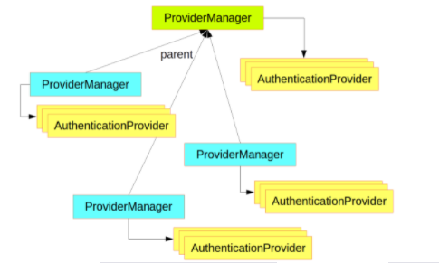

#  Spring Authentication

## Spring Security Architecture

**Authentication and Access Control**

*  Authentication: who are you?

* Authorization: what are you allowed to do?

* Access Control: it can be helpful to think of it that way because “authorization” is overloaded in other places. 

### Authentication

The main strategy interface for authentication is `AuthenticationManager`, which has only one method:

     public interface AuthenticationManager {

     Authentication authenticate(Authentication authentication)

     throws AuthenticationException;

     }
>

An `AuthenticationManager` can do one of 3 things in its `authenticate()` method:

1- Return an `Authentication` (normally with authenticated=true) if it can verify that the input represents a valid principal.

2- Throw an `AuthenticationException` if it believes that the input represents an invalid principal.

3- Return `null` if it cannot decide.

The most commonly used implementation of `AuthenticationManager` is `ProviderManager`: 

     public interface AuthenticationProvider {

	 Authentication authenticate(Authentication authentication)
			throws AuthenticationException;

	 boolean supports(Class<?> authentication);
     }
>

The `Class<?>` argument in the `supports()` method is really `Class<? extends Authentication>` (it is only ever asked if it supports something that is passed into the `authenticate()` method).

The parent is a kind of “global” resource, acting as a fallback for all providers.

### Customizing Authentication Managers

AuthenticationManagerBuilder: is a helper to quickly get common authentication manager features set up in your application. 

The following example shows an application that configures the global (parent) `AuthenticationManager`:

     @Configuration
     public class ApplicationSecurity extends WebSecurityConfigurerAdapter {

      ... // web stuff here

     @Autowired
     public void initialize(AuthenticationManagerBuilder builder, DataSource dataSource) {
      builder.jdbcAuthentication().dataSource(dataSource).withUser("dave")
      .password("secret").roles("USER");
     }

     }
>

The `AuthenticationManagerBuilder` is `@Autowired` into a method in a `@Bean` — that is what makes it build the global (parent) `AuthenticationManager`. In contrast, consider the following example:

     @Configuration
     public class ApplicationSecurity extends WebSecurityConfigurerAdapter {

     @Autowired
     DataSource dataSource;

     ... // web stuff here

     @Override
     public void configure(AuthenticationManagerBuilder builder) {
     builder.jdbcAuthentication().dataSource(dataSource).withUser("dave")
      .password("secret").roles("USER");
       }

     }

### Authorization or Access Control

Once authentication is successful, we can move on to authorization, and the core strategy here is `AccessDecisionManager`.

     @Configuration
     boolean supports(ConfigAttribute attribute);

     boolean supports(Class<?> clazz);

      int vote(Authentication authentication, S object,
        Collection<ConfigAttribute> attributes);

## Web Security    

Spring Security in the web is based on Servlet Filters. The following picture shows a single HTTP request.

