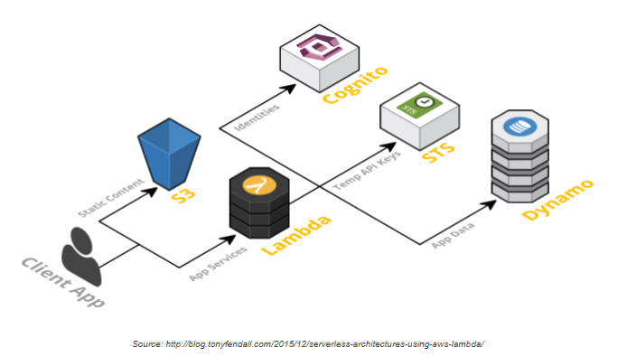

# Serverless and Amplify
## What is Serverless Architecture? What are its Pros and Cons?
- Serverless is a cloud computing execution model where the cloud provider dynamically manages the allocation and provisioning of servers. 
- Serverless applications are event-driven cloud-based systems where application development rely solely on a combination of third-party services, client-side logic and cloud-hosted remote procedure calls (Functions as a Service).

**The Serverless App**
A Serverless solution consists of a web server, Lambda functions (FaaS), security token service (STS), user authentication and database.

* Client Application: The UI of your application is rendered client side in Modern Frontend Javascript App which allows us to use a simple, static web server.
* Web Server: Amazon S3 provides a robust and simple web server.
* Lambda functions (FaaS): They are the key enablers in Serverless architecture. 
* Security Token Service (STS): generates temporary AWS credentials (API key and secret key) for users of the application. 
* User Authentication: AWS Cognito is an identity service which is integrated with AWS Lambda. With Amazon Cognito, you can easily add user sign-up and sign-in to your mobile and web apps.
* Database: AWS DynamoDB provides a fully managed NoSQL database.

## API (GRAPHQL)
- The GraphQL Transform provides a simple to use abstraction that helps you quickly create backends for your web and mobile applications on AWS. 

You might create the backend for a blog like this:

     type Blog @model {
     id: ID!
     name: String!
     posts: [Post] @connection(name: "BlogPosts")
     }
     type Post @model {
     id: ID!
     title: String!
     blog: Blog @connection(name: "BlogPosts")
     comments: [Comment] @connection(name: "PostComments")
     }
     type Comment @model {
      id: ID!
      content: String
      post: Post @connection(name: "PostComments")
     }

**Create a GraphQL API**
Navigate into the root of a JavaScript, iOS, or Android project and run:

    amplify init

Follow the wizard to create a new app. After finishing the wizard run:

     amplify add api    

**Test the API**      

Once the API is finished deploying, go to the AWS AppSync console or run `amplify mock api` to try some of these queries in your new API’s query page.

