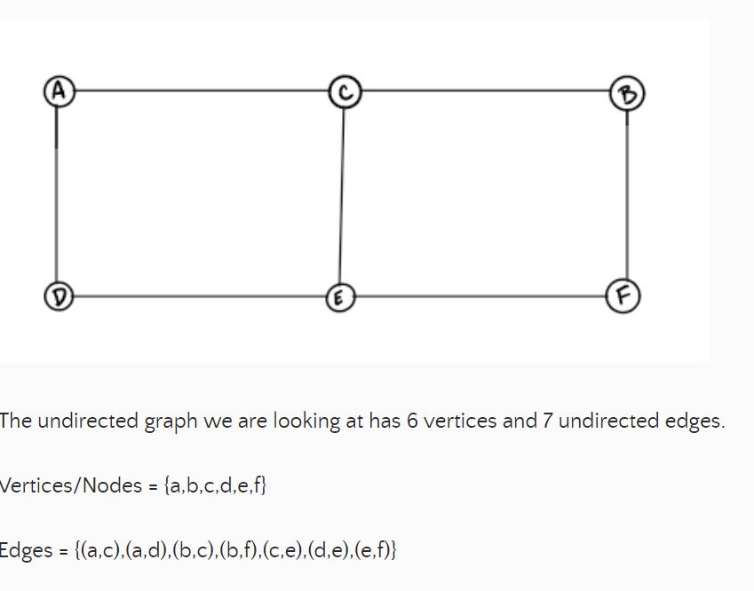
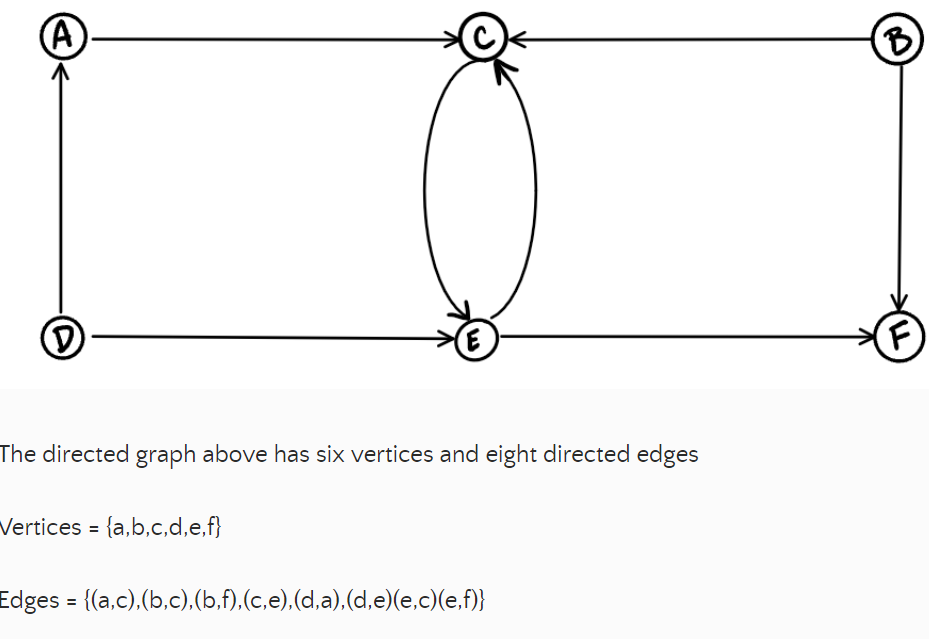

# Graphs

A graph is a non-linear data structure.
Here is some common terminology used when working with Graphs:

* Vertex : `node` is a data object that can have zero or more adjacent vertices.
* Edge : is a connection between two nodes.
* Neighbor : The neighbors of a node are its adjacent nodes, are connected via an edge.
* Degree : The degree of a vertex is the number of edges connected to that vertex.

**Undirected Graphs**
An Undirected Graph is a graph where each edge is undirected or bi-directional. This means that the undirected graph does not move in any direction.

**Directed Graphs (Digraph)**
A Directed Graph also called a Digraph is a graph where every edge is directed, a Digraph has direction.

**Complete Graphs**
A complete graph is when all nodes are connected to all other nodes.

**Connected**
A connected graph is graph that has all of vertices/nodes have at least one edge.  A Tree is a form of a connected graph.

**Disconnected**
A disconnected graph is a graph where some vertices may not have edges.

**Acyclic Graph**
An acyclic graph is a directed graph without cycles. A directed acyclic graph is also called a DAG.

**Cyclic Graphs**
A Cyclic graph is a graph that has cycles.

**Graph Representation**

We represent graphs through:

- Adjacency Matrix : is represented through a 2-dimensional array, If there are n vertices, then we are looking at an n x n Boolean matrix.
- Adjacency List : is a collection of linked lists or array that lists all of the other vertices that are connected.

**Weighted Graphs**
A weighted graph is a graph with numbers assigned to its edges. These numbers are called weights.

**Psaudocode for a breadth first traversal:**

     ALGORITHM BreadthFirst(vertex)
     DECLARE nodes <-- new List()
     DECLARE breadth <-- new Queue()
     DECLARE visited <-- new Set()

     breadth.Enqueue(vertex)
     visited.Add(vertex)

     while (breadth is not empty)
        DECLARE front <-- breadth.Dequeue()
        nodes.Add(front)

        for each child in front.Children
            if(child is not visited)
                visited.Add(child)
                breadth.Enqueue(child)   

     return nodes;